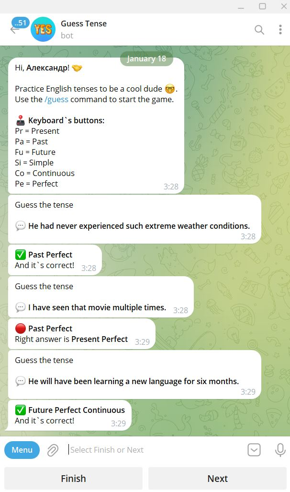

# Guess Tense Bot
 

It is a simple simulator that helps you practice English tenses. If an incorrect answer is given, a message appears with the correct option.

## Used technology
* Python 3.11;
* aiogram 3.x (Telegram Bot framework);
* Django 4.x (Web framework);
* Django REST framework;
* SQLite3 (database);
